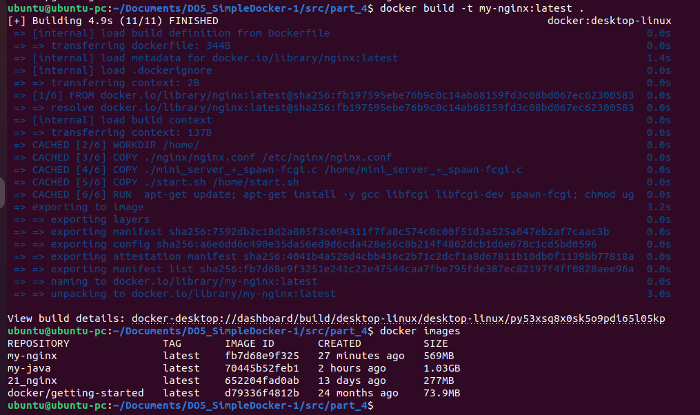
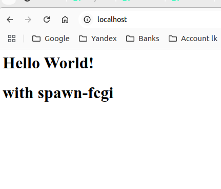
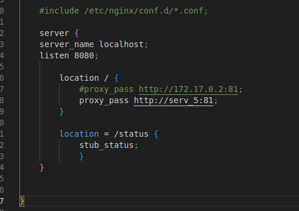

# DO5_Simple Docker. Report

## Part 1. Готовый докер

В качестве конечной цели своей небольшой практики ты сразу выбрал написание докер-образа для собственного веб-сервера, а потому в начале тебе нужно разобраться с уже готовым докер-образом для сервера.

Твой выбор пал на довольно простой nginx.

== Задание ==

- Возьми официальный докер-образ с nginx и выкачай его при помощи docker pull.

- Проверь наличие докер-образа через docker images.

- Запусти докер-образ через docker run -d [image_id|repository].

- Проверь, что образ запустился через docker ps.

- Посмотри информацию о контейнере через docker inspect [container_id|container_name].

- По выводу команды определи и помести в отчёт размер контейнера, список замапленных портов и ip контейнера.

- Останови докер контейнер через docker stop [container_id|container_name].

- Проверь, что контейнер остановился через docker ps.

- Запусти докер с портами 80 и 443 в контейнере, замапленными на такие же порты на локальной машине, через команду run.

- Проверь, что в браузере по адресу localhost:80 доступна стартовая страница nginx.

- Перезапусти докер контейнер через docker restart [container_id|container_name].

- Проверь любым способом, что контейнер запустился.

В отчёт помести скрины:

вызова и вывода всех использованных в этой части задания команд;
стартовой страницы nginx по адресу localhost:80 (адрес должен быть виден).

Замечание: Не загружай тяжелые файлы (>10 мб) в гит.

## Part 2. Операции с контейнером
Докер-образ и контейнер готовы. Теперь можно покопаться в конфигурации nginx и отобразить статус страницы.

== Задание ==

- Прочитай конфигурационный файл nginx.conf внутри докер контейнера через команду exec.

- Создай на локальной машине файл nginx.conf.

- Настрой в нем по пути /status отдачу страницы статуса сервера nginx.

- Скопируй созданный файл nginx.conf внутрь докер-образа через команду docker cp.

- Перезапусти nginx внутри докер-образа через команду exec.

- Проверь, что по адресу localhost:80/status отдается страничка со статусом сервера nginx.

- Экспортируй контейнер в файл container.tar через команду export.

- Останови контейнер.

- Удали образ через docker rmi [image_id|repository], не удаляя перед этим контейнеры.

- Удали остановленный контейнер.

- Импортируй контейнер обратно через команду import.

- Запусти импортированный контейнер.

- Проверь, что по адресу localhost:80/status отдается страничка со статусом сервера nginx.

В отчёт помести скрины:

вызова и вывода всех использованных в этой части задания команд;
содержимое созданного файла nginx.conf;
страницы со статусом сервера nginx по адресу localhost:80/status.

## Part 3. Мини веб-сервер

Теперь стоит немного оторваться от докера, чтобы подготовиться к последнему этапу. Время написать свой сервер.

== Задание ==

- Напиши мини-сервер на C и FastCgi, который будет возвращать простейшую страничку с надписью Hello World!.

Устанавливаем либу <fcgiapp.h>
 
sudo apt-get install libfcgi libfcgi-dev

gcc ./mini_server_-_spawn-fcgi.c -o mini_server_-_spawn-fcgi -lfcgi

- Запусти написанный мини-сервер через spawn-fcgi на порту 8080.

sudo apt-get install spawn-fcgi

gcc ./mini_server_+_spawn-fcgi.c -o mini_server_+_spawn-fcgi -lfcgi

spawn-fcgi -p 8080 -n ./mini_server_+_spawn-fcgi

- Напиши свой nginx.conf, который будет проксировать все запросы с 81 порта на 127.0.0.1:8080.

выше уже есть

- Проверь, что в браузере по localhost:81 отдается написанная тобой страничка.

выше уже есть два варианта: без и с spawn-fcgi

- Положи файл nginx.conf по пути ./nginx/nginx.conf (это понадобится позже).

## Part 4. Свой докер

Теперь всё готово. Можно приступать к написанию докер-образа для созданного сервера.
== Задание ==
При написании докер-образа избегай множественных вызовов команд RUN

- Напиши свой докер-образ, который:

1) собирает исходники мини сервера на FastCgi из Части 3;

2) запускает его на 8080 порту;

3) копирует внутрь образа написанный ./nginx/nginx.conf;

4) запускает nginx.
nginx можно установить внутрь докера самостоятельно, а можно воспользоваться готовым образом с nginx'ом, как базовым.

- Собери написанный докер-образ через docker build при этом указав имя и тег.

docker build -t my-nginx:latest .

- Проверь через docker images, что все собралось корректно.

- Запусти собранный докер-образ с маппингом 81 порта на 80 на локальной машине и маппингом папки ./nginx внутрь контейнера по адресу, где лежат конфигурационные файлы nginx'а (см. Часть 2).

docker run -d -p 80:81 my-nginx

- Проверь, что по localhost:80 доступна страничка написанного мини сервера.

- Допиши в ./nginx/nginx.conf проксирование странички /status, по которой надо отдавать статус сервера nginx.

Перезапусти докер-образ.
Если всё сделано верно, то, после сохранения файла и перезапуска контейнера, конфигурационный файл внутри докер-образа должен обновиться самостоятельно без лишних действий.

Проверь, что теперь по localhost:80/status отдается страничка со статусом nginx

## Part 5. Dockle

После написания образа никогда не будет лишним проверить его на безопасность.
== Задание ==

- Просканируй образ из предыдущего задания через dockle [image_id|repository].

docker save my-nginx:latest -o my.tar

dockle --input my.tar

- Исправь образ так, чтобы при проверке через dockle не было ошибок и предупреждений.

## Part 6. Базовый Docker Compose

Вот ты и закончил свою разминку. А хотя погоди...
Почему бы не поэкспериментировать с развёртыванием проекта, состоящего сразу из нескольких докер-образов?
== Задание ==

Напиши файл docker-compose.yml, с помощью которого:

- 1) Подними докер-контейнер из Части 5 (он должен работать в локальной сети, т. е. не нужно использовать инструкцию EXPOSE и мапить порты на локальную машину).

docker build -t serv5 ./part_5/

docker run -d serv5

docke inspect CONTAINER_ID ищем IP 172.17.0.2 и вписываем в nginx.conf serv6

- 2) Подними докер-контейнер с nginx, который будет проксировать все запросы с 8080 порта на 81 порт первого контейнера.

Замапь 8080 порт второго контейнера на 80 порт локальной машины.

docker build -t serv6 ./part_6/

docker run -d -p 80:8080 serv6

- Запускаем проверям:

- Останови все запущенные контейнеры.

-  Файл docker-compose.yml

-  Меням у проксирующего сервера nginx.conf 

- Собери и запусти проект с помощью команд docker-compose build и docker-compose up.

- Проверь, что в браузере по localhost:80 отдается написанная тобой страничка, как и ранее.

