# DO5_SimpleDocker

## Part 1. Ready-made docker

- Take the official docker image from nginx and download it using `docker pull`
  - 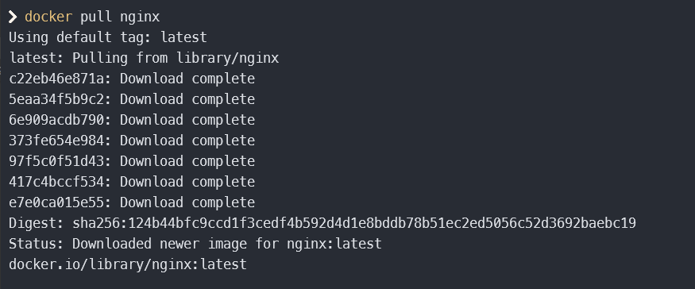
  - *`docker pull nginx`*
&nbsp;
- Check for the docker image with `docker images`
  - 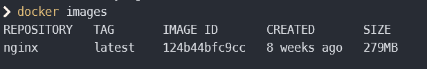
  - *`docker images`*
&nbsp;
- Run docker image with `docker run -d [image_id|repository]`
  - 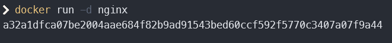
  - *`docker run -d nginx`*
&nbsp;
- Check that the image is running with `docker ps`
  - 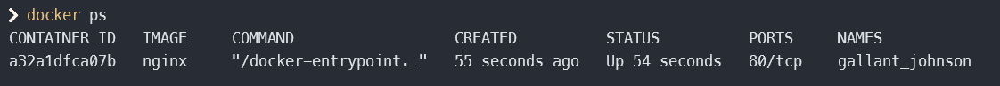
  - *`docker ps`*
&nbsp;
- View container information with `docker inspect [container_id|container_name]`
  - ![Рис. 5: docker inspect [container_id]](./img/05_docker_inspect_container.png)
  - *`docker inspect [container_id]`*
&nbsp;
- From the command output define and write in the report the container size, list of mapped ports and container ip
  - 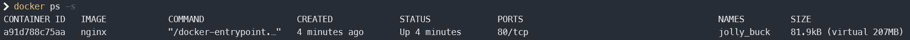
  - **Container size:** 81.9kB (207MB virtual)
  - **Mapped ports:** "80/tcp": null
  - **IPAddress:** 172.17.0.2
&nbsp;
- Stop docker container with `docker stop [container_id|container_name]`
  - ![Рис. 7: docker stop [container_id]](./img/06_docker_stop_container.png)
  - *`docker stop [container_id]`*
&nbsp;
- Check that the container has stopped with docker ps.
  - 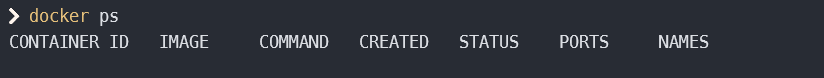
  - *`docker ps`*
&nbsp;
- Run docker with ports 80 and 443 in container, mapped to the same ports on the local machine, with run command.
  - 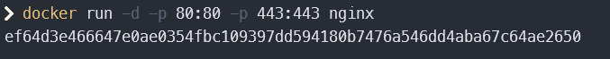
  - *`docker run -d -p 80:80 -p 443:443 nginx`*
&nbsp;
- Check that the nginx start page is available in the browser at localhost:80
  - 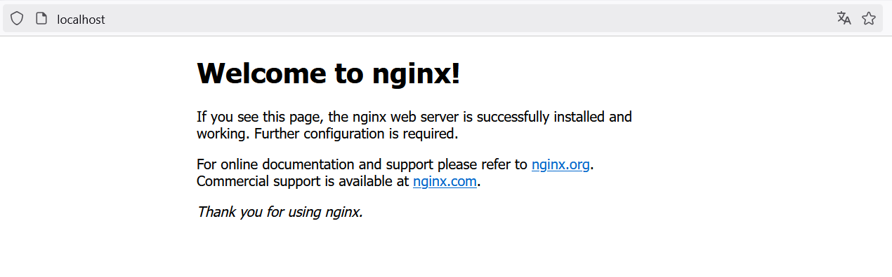
  - *`localhost:80`*
&nbsp;
- Restart docker container with `docker restart [container_id|container_name]`.
  - ![Рис. 11: docker restart [container_id]](./img/10_docker_restart.png)
  - *`docker restart [container_id]`*
&nbsp;
- Check in any way that the container is running.
  - 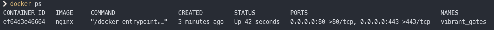
  - *`docker ps`*
&nbsp;

## Part 2. Operations with container

- Read the nginx.conf configuration file inside the docker container with the `exec` command.
  - ![Рис. 12: docker exec [container_id] cat /etc/nginx/nginx.conf](./img/12_docker_exec_nginx_conf.png)
  - *`docker exec [container_id] cat /etc/nginx/nginx.conf`*
&nbsp;
- Create a nginx.conf file on a local machine.
- Configure it on the /status path to return the nginx server status page.

  ```nginx
    user nginx;
    worker_processes auto;

    error_log /var/log/nginx/error.log notice;
    pid /var/run/nginx.pid;

    events {
        worker_connections 1024;
    }

    http {
        include /etc/nginx/mime.types;
        default_type application/octet-stream;

        server {
            listen 80;
            server_name  localhost;

            location /status {
                stub_status on;
                allow all;
            }
        }

        log_format main '$remote_addr - $remote_user [$time_local] "$request" '
        '$status $body_bytes_sent "$http_referer" '
        '"$http_user_agent" "$http_x_forwarded_for"';

        access_log /var/log/nginx/access.log main;

        sendfile on;
        keepalive_timeout 65;
    }
  ```

- Copy the created nginx.conf file inside the docker image using the `docker cp` command.
  - ![Рис. 13: docker cp ./nginx.conf [container_id]:/etc/nginx/nginx.conf](./img/13_docker_cp_nginx_conf.png)
  - *`docker cp ./nginx.conf [container_id]:/etc/nginx/nginx.conf`*
&nbsp;
- Restart nginx inside the docker image with `exec`.
  - ![Рис. 14: docker exec [container_id] nginx -s reload](./img/14_docker_nginx_restart.png)
  - *`docker exec [container_id] nginx -s reload`*
&nbsp;
- Check that `localhost:80/status` returns the nginx server status page.
  - 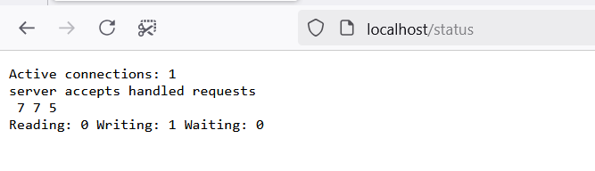
  - *`localhost:80/status`*
&nbsp;
- Export the container to a `container.tar` file with the export command.
  - ![Рис. 16: docker export [container_id] > container.tar](./img/16_docker_export.png)
  - *`docker export [container_id] > container.tar`*
&nbsp;
- Stop the container.
  - ![Рис. 17: docker stop [container_id]](./img/17_docker_stop.png)
  - *`docker stop [container_id]`*
&nbsp;
- Delete the image with `docker rmi [image_id|repository]` without removing the container first.
  - ![Рис. 18: docker rmi -f [repository]](./img/18_docker_rmi.png)
  - *`docker rmi -f [repository]`*
&nbsp;
- Delete stopped container.
  - ![Рис. 19: docker rm [container_id]](./img/19_docker_rm_container.png)
  - *`docker rm [container_id]`*
&nbsp;
- Import the container back using the import command.
  - ![Рис. 20: docker import container.tar [image_name]](./img/20_docker_import_container.png)
  - *`docker import container.tar [image_name]`*
&nbsp;
- Run the imported container.
  - ![Рис. 21: docker run -d -p 80:80 -p 443:443 [image_name] nginx](./img/21_docker_import_container_run.png)
  - *`docker run -d -p 80:80 -p 443:443 [image_name] nginx`*
&nbsp;
- Check that localhost:80/status returns the nginx server status page.
  - 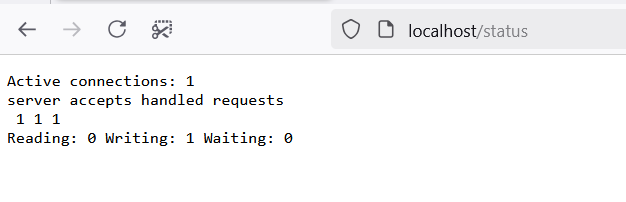
  - *`localhost:80/status`*


docker run -d -p 80:80 -v "$(pwd)/server/nginx.conf:/etc/nginx/nginx.conf" --name fcgi-app school21-fcgi-server:1.0

## Part 3. Mini web server

- Write a mini server in C and FastCgi that will return a simple page saying `Hello World!`
  - 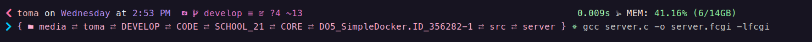
  - *`gcc server.c -o server.fcgi -lfcgi`*
&nbsp;
- Run the written mini server via spawn-fcgi on port 8080
  - 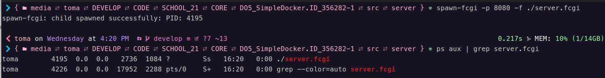
  - *`spawn-fcgi -p 8080 -f ./server.fcgi`*
&nbsp;
- Write your own nginx.conf that will proxy all requests from port 81 to 127.0.0.1:8080
  - 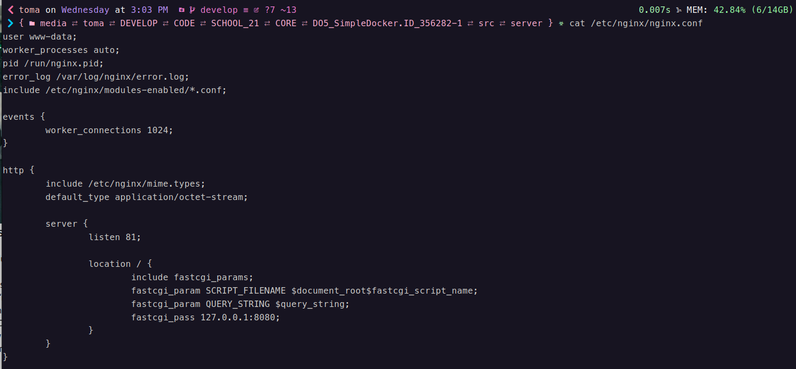
  - *`cat /etc/nginx/nginx.conf`*
&nbsp;
- Check that browser on localhost:81 returns the page you wrote
  - 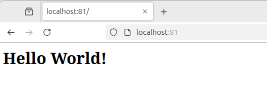
  - *`localhost:81`*

## Part 4. Your own docker

- Write your own docker image that:
  1) builds mini server sources on FastCgi from [Part 3];
  2) runs it on port 8080;
  3) copies inside the image written ./nginx/nginx.conf;
  4) runs nginx.
  - 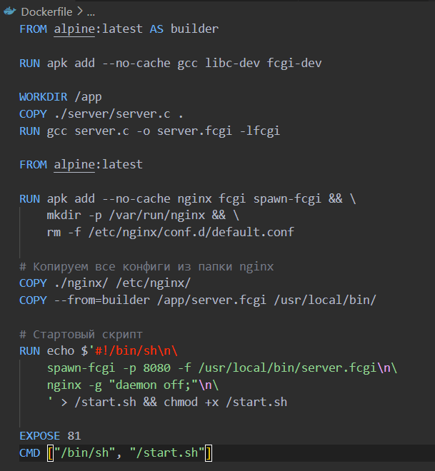
  - *`Dockerfile`*
&nbsp;
- Build the written docker image with docker build, specifying the name and tag
  - 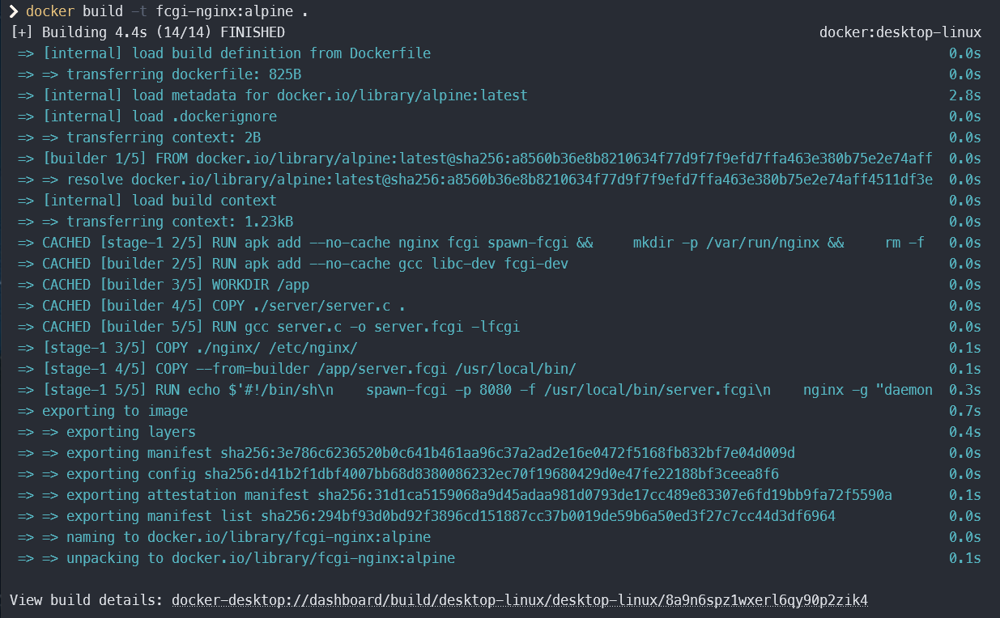
  - *`docker build -t fcgi-nginx:alpine .`*
&nbsp;
- Check with docker images that everything is built correctly
  - 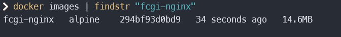
  - *`docker images | findstr "fcgi-nginx"`*
&nbsp;
- Run the built docker image by mapping port 81 to 80 on the local machine and mapping the ./nginx folder inside the container to the address where the nginx configuration files are located (see Part 2)
  - 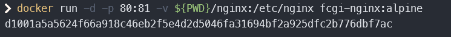
  - *`docker run -d -p 80:81 -v ${PWD}/nginx:/etc/nginx fcgi-nginx:alpine`*
&nbsp;
- Check that the page of the written mini server is available on localhost:80
  - 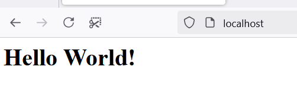
  - *`localhost`*
&nbsp;
- Add proxying of /status page in ./nginx/nginx.conf to return the nginx server status.
  - 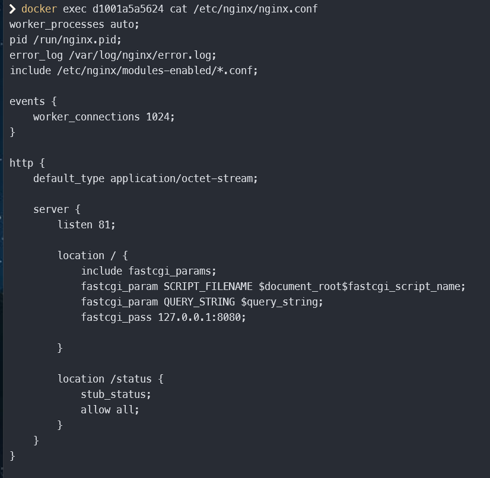
  - *`update nfinx.conf`*
&nbsp;
- Restart docker image.
  - ![Рис. 33: docker restart [container_id]](./img/33_docker_update_and_restart.png)
  - *`docker restart [container_id]`*
&nbsp;
- Check that localhost:80/status now returns a page with nginx status
  - 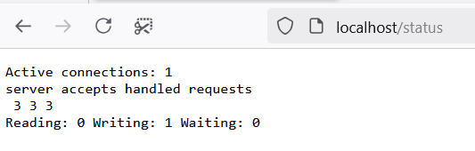
  - *`localhost/status`*

## Part 5. Dockle

- Check the image from the previous task with dockle [image_id|repository]
  - 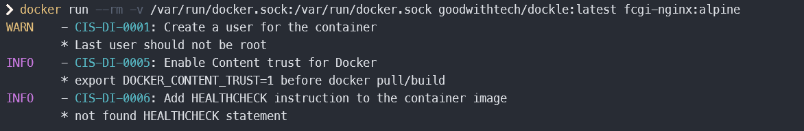
  - *`docker run --rm -v /var/run/docker.sock:/var/run/docker.sock goodwithtech/dockle:latest fcgi-nginx:alpine`*
&nbsp;
- Fix the image so that there are no errors or warnings when checking with dockle
  - 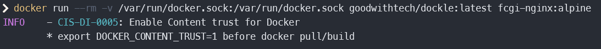
  - *`docker run --rm -v /var/run/docker.sock:/var/run/docker.sock goodwithtech/dockle:latest fcgi-nginx:alpine`*

## Part 6. Basic Docker Compose

- Write a docker-compose.yml file, using which:
  1) Start the docker container from Part 5 (it must work on local network, i.e., you don't need to use EXPOSE instruction and map ports to local machine).
  2) Start the docker container with nginx which will proxy all requests from port 8080 to port 81 of the first container.
  - 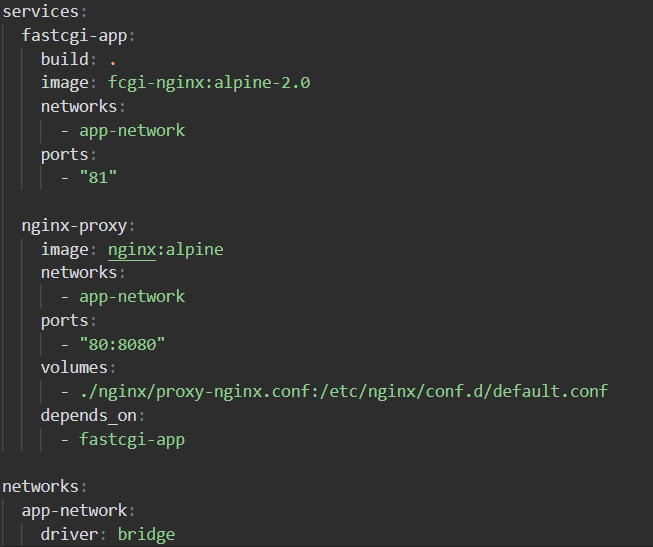
  - *`docker-compose.yml`*
&nbsp;
- Map port 8080 of the second container to port 80 of the local machine
  - 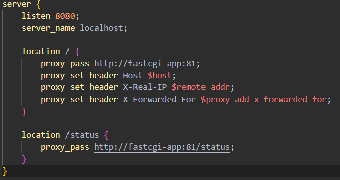
  - *`proxy-nginx.conf to map ports`*
&nbsp;
- Stop all running containers
  - 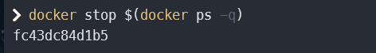
  - *`docker stop $(docker ps -q)`*
&nbsp;
- Build and run the project with the docker-compose build and docker-compose up commands
  - 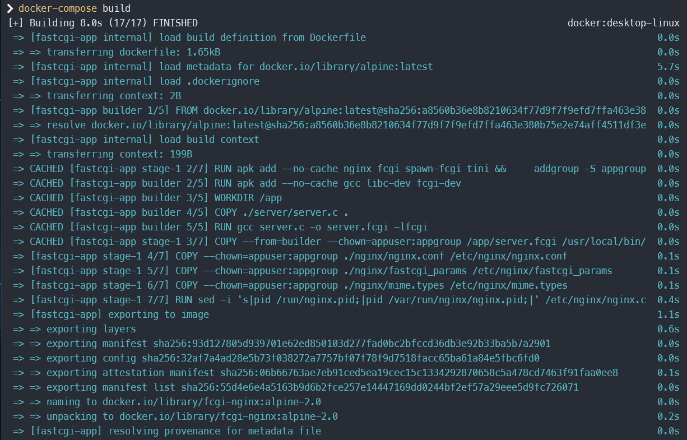
  - *`docker-compose build`*
  - 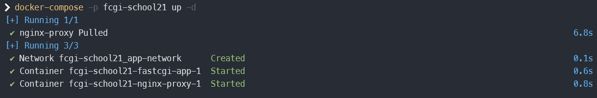
  - *`docker-compose -p fcgi-school21 up -d`*
&nbsp;
- Check that the browser returns the page you wrote on localhost:80 as before
  - 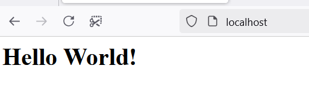
  - *`localhost`*
